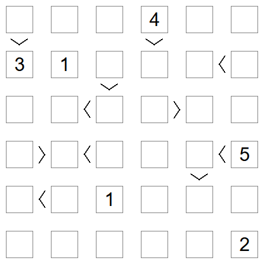

# Futoshiki

Futoshiki is a puzzle where you have to complete a latin square,
i.e. every row and every column has the numbers 1..6, adhering to some 
greater-than constraints.



See for example the website [https://www.futoshiki.com](https://www.futoshiki.com/).


## Solver

I have written a [solver](futoshiki.c) for it.

Here is an example run.

```
> gcc futoshiki.c -o futoshiki.exe && futoshiki.exe
Assignment
  |[00,00,10,50,0C,20]
  |
  | .. .. 4. .. ..<.. [10]
  | 00 01 02 03 04 05
  | ^  v     ^
  | .. ..>.. 6. .. 5. [60]
  | 06 07 08 09 10 11
  |    ^           v
  | .. ..<.. ..>.. .. [00]
  | 12 13 14 15 16 17
  |
  | ..<.. .. .. .. .. [00]
  | 18 19 20 21 22 23
  |          ^
  | .. .. ..>.. 2. .. [04]
  | 24 25 26 27 28 29
  |          ^
  | .. ..>.. 4. 3. .. [18]
  | 30 31 32 33 34 35
Solution 1
  | 1. 3. 4. 2. 5.<6.
  | ^  v     ^
  | 3. 2.>1. 6. 4. 5.
  |    ^           v
  | 2. 4.<6. 5.>1. 3.
  |
  | 4.<5. 3. 1. 6. 2.
  |          ^
  | 6. 1. 5.>3. 2. 4.
  |          ^
  | 5. 6.>2. 4. 3. 1.
done (1)
```

(end)
