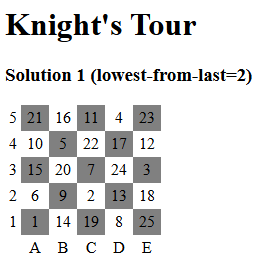

# Knight's tour

Can a knight make a tour on a chess board, i.e. using official chess moves, one by one visit all board positions.

## Solver

In this example, I use a 5x5 board. 
This means there is an odd number of cells, therefore the first position is on the same cell color as the last position.
In other words, on a 5x5 board a closed tour is never possible.

I wrote a solver in [javascript](knight.js) and a [html wrapper](knight.html).

(end)
