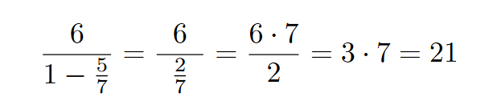

# Form 21 with 1, 5, 6, 7

Using only the four numbers 1, 5, 6, 7 form an expression with just +, -, *, / that yields 21.

Yes that is possible.


## Solver

I wrote a solver in [C](solve1567.c) and in [python](1567.py).

I prints all possible expressions, 7680 in total, and their outcome.
This is a long [list](solve1567.log) but one expression computes to 21.

```
 5596: 6/( 1-(5 /7)) = 42/2 = 21 <<== EQUAL
```




(end)
